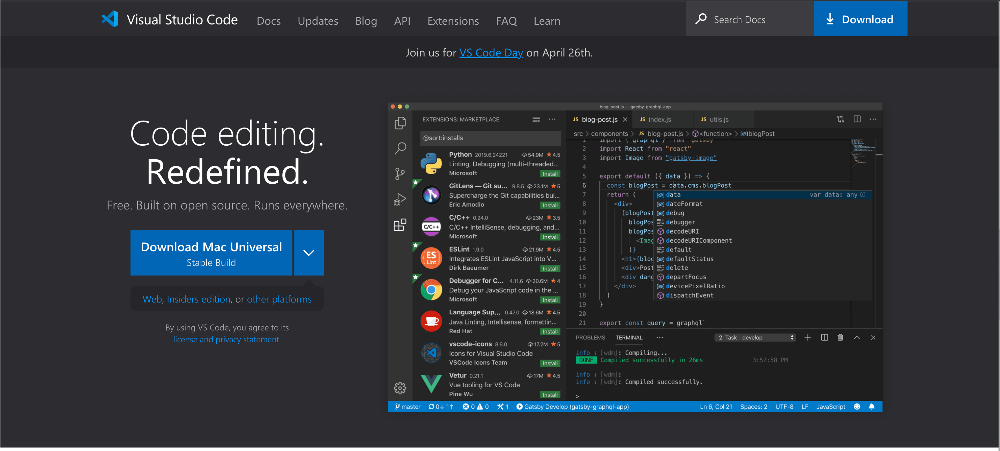
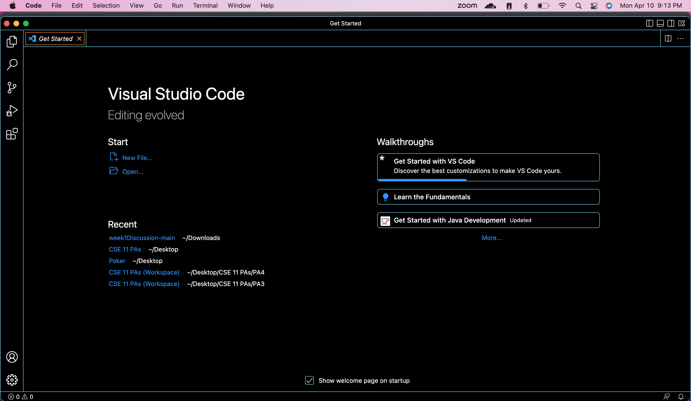
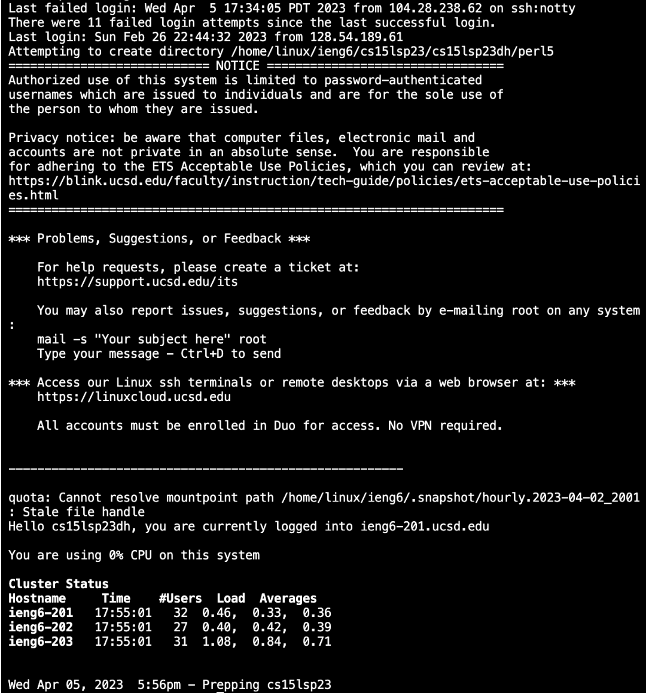

# Lab Report 1

1. Go to [VSCode](https://code.visualstudio.com/)
2. Click the drop down menu next to the blue download button on the left side of the screen
3. Select the Stable version for your operating system
4. Open the zip file and Visual Studio should be downloaded onto your computer

1. Open Visual Studio Code and it should look like the image above
2. Click the Terminal tab at the top and click New Teriminal
3. Go to [Account Looku0](https://sdacs.ucsd.edu/~icc/index.php)
4. Type in your Username and and PID
5. Under Additional Accounts it should say your cs15l account username
6. If you don't have a password set then click the link in the yellow box and follow those instructions
7. Go back to Visual Studio and type in ssh plus the username you just located into the terminal plus @ieng6.ucsd.edu
8. It should look like ssh cs15lsp23zz@ieng6.ucsd.edu, except the zz will be letters specific for your account
9. You will get a message asking if you're sure you want to connect
10. Type in yes
11. Type in the password that you set up early
12. Note that you will not see yourself typing, but it actually is typing
13. Also if you just set up your password you may have to wait up to 30 minutes for the system to update so keep that in mind
14. If all went well you should get a message that says this

