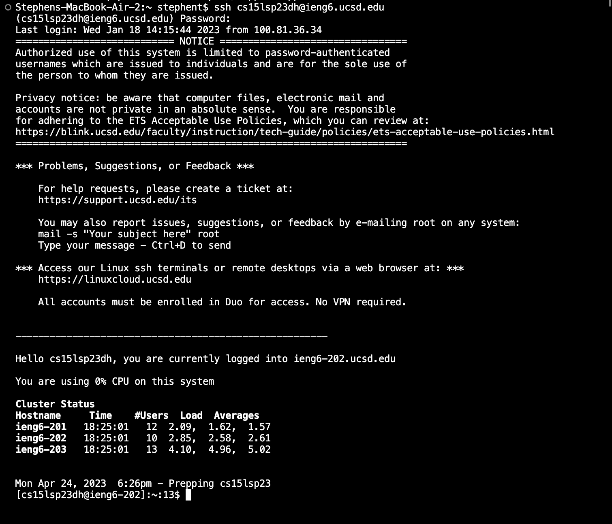
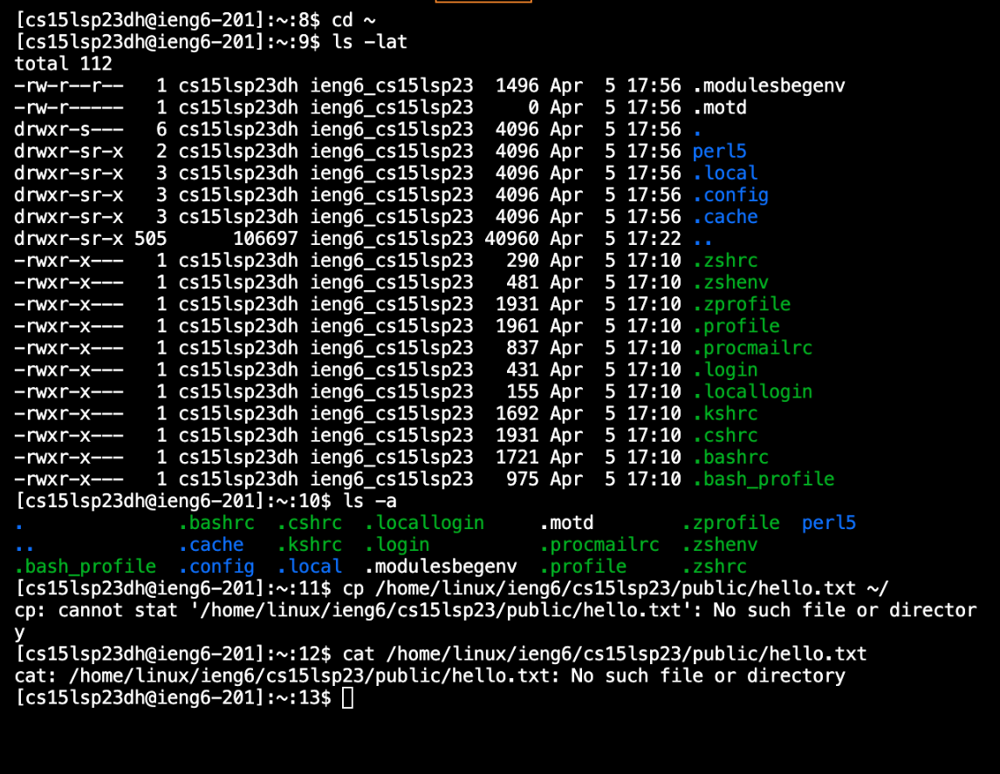

# Lab Report 1

## Downloading VSCode

1. Go to [VSCode](https://code.visualstudio.com/)
2. Click the drop down menu next to the blue download button on the left side of the screen
3. Select the Stable version for your operating system
4. Open the zip file and Visual Studio should be downloaded onto your computer

## Remotely Connecting

1. Open Visual Studio Code and it should look like the image above
2. Click the Terminal tab at the top and click New Terminal
3. Go to [Account Lookup](https://sdacs.ucsd.edu/~icc/index.php)
4. Type in your Username and and PID
5. Under Additional Accounts it should say your cs15l account username
6. If you don't have a password set then click the link in the yellow box and follow those instructions
7. Go back to Visual Studio and type in ssh plus the username you just located into the terminal plus @ieng6.ucsd.edu
8. It should look like `ssh cs15lsp23zz@ieng6.ucsd.edu`, except the zz will be letters specific for your account
9. You will get a message asking if you're sure you want to connect
10. Type in yes
11. Type in the password that you set up early
12. Note that you will not see yourself typing, but it actually is typing
13. Also if you just set up your password you may have to wait up to 30 minutes for the system to update so keep that in mind
14. If all went well you should get a message that says this

15. Keep in mind that you might have multiple password attempts which is why my terminal says a bunch of failed password attempts

## Running Some Commands

1. Now that you are logged in you can type `clear` into you terminal just so it's not so messy
2. You should try typing some of the commands below
* `cd ~` (change working directory to home directory)
* `cd` (change working directory to first argument entered)
* `ls -lat` (list of files sorted by date)
* `ls -a` (lists everything including things that start with .)
* `ls <directory>` where `<directory>` is `/home/linux/ieng6/cs15lsp23/cs15lsp23abc`, where the abc is one of the other group members’ username (lists files in that directory)
* `cp /home/linux/ieng6/cs15lsp23/public/hello.txt ~/` (makes a copy of that file)
* `cat /home/linux/ieng6/cs15lsp23/public/hello.txt` (prints out contents of that file)
3. This is an example of some of the commands and what they do

