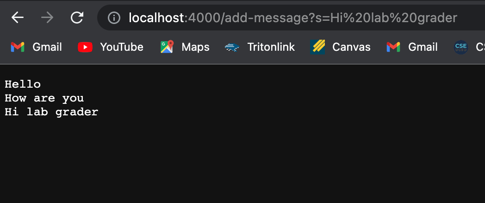

# Lab Report 2

## Part 1

The `handlerequest` method is being called, which will add whatever comes after s in the query if the path is add-message. The relevant argument is the url you give it. The url would be `http://localhost:4000/add-message?s=How%20are%20you`.
The intial value of `strs` would be `"Hello"` and then after the `/add` path it would be `"Hello \n How are you"`. `strs` is a field since it is created outside the class and is given the value of `""`. The `parameters` array would be `{"s", "How are you"}`. The 
`parameters` array doesn't change at all because it was just created. It is also a local variable since it is created within the `handleRequest` method.

The `handlerequest` method is being called again. The argument would still be the url. The url this time however would be `http://localhost:4000/add-message?s=Hi%20lab%20grader`.
The initial value of `strs` would be `"Hello \n How are you"`, since it keeps the value from the last `/add` path. Then after the path it would be `"Hello \n How are you \n Hi lab grader"`. It again is a field, and it shows this by holding the value of the last method call. The `parameters` array would be 
`{"s", "Hi lab grader"}`. This again wouldn't change because it was just created in this instance. This also is still a local variable, and it shows this because it is different than the last time since its previous value got erased after the method ended.

## Part 2

This is the bug I chose.

This input will result in the correct output.

This input will result in the wrong output.

This is what happens when you run these JUnit tests.

This is the fixed code. To fix the bug you have to swap arr and newArray in the for-loop. This fixes the bug because before it was adding the elements of newArray into arr. This doesn't work because the elements of newArray are null since it was just created. You have to add the elements of arr into newArray so you accurately make a reversed copy.

## Part 3

I learned how I can use paths to do certain tasks on a website I create. I find it useful to know how different companies implement search and creating new strings and other things with paths on their URLs. I also find the get methods for different parts of a URL useful and that is something else I learned.
