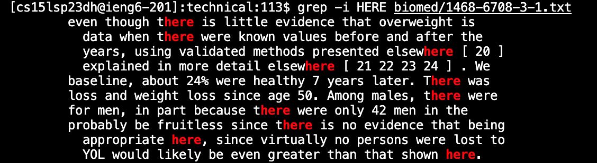
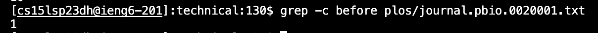
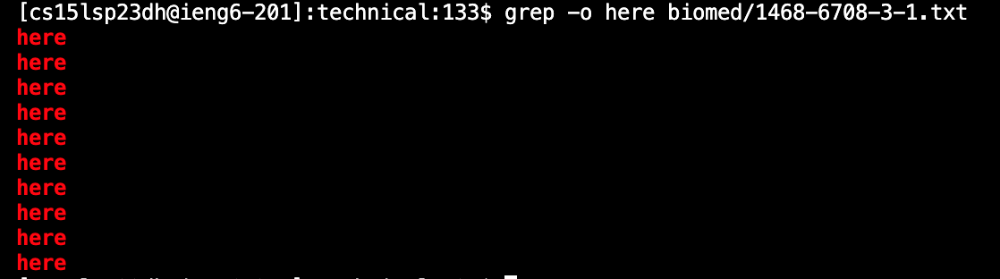
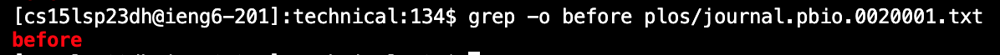
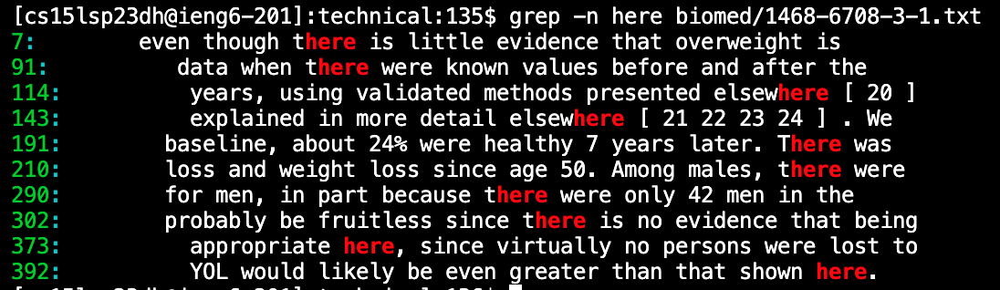
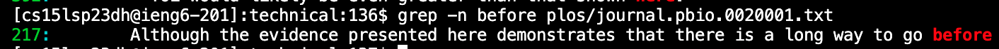

# Command-Line Options for Grep

## -i Option

### First Example

I'm searching for `HERE` in a file in biomed with the `-i` command-line option which ignores capitilization. I showed this by capatzlizing the whole thing, but the lines that come up are all lowercase showing that it worked properly, and this is useful if you're just looking for that word or phrase and don't care about the specifics of the capitilization.

### Second Example

Here I searched for `bEfOrE` with the `-i` command-line option in a file in plos, and I again emphasized this by mixing up the capitilization of before. This again useful for the reason I stated above.

## -c Option

### First Example

I searched for `here` in the same file in biomed with the `-c` command-line option which only gives you the number of lines that that word or phrase appears on. This is really useful if you just want the count of whatever you're searching for.

### Second Example

I searched for `before` in the same file in plos with the `-c` command-line option. This is again useful for the same reason as above especially if the word you're searching for is common and you can't count the number of lines by yourself.

## -o Option

### First Example

I searched for `here` in the same file in biomed again, except with the `-o` command-line option, which only prints the actual word or phrase you're looking for and not the whole line. This isn't super useful, but may be helpful if combined with another command-line option since it doesn't take up as much space as a whole line.

### Second Example

I again searched for `before` in the same file in plos with the `-o` command-line option. This again isn't super useful, except when combined with another command-line option, like the next one I'm going to show.

## -n Option

### First Example

I'm searching for `here` in the same file in biomed with the -n command-line option this time, which prints the line number before the actual line. This is really useful if you want to look back at the file and be able to find what line the word or phrase is on in the future.

### Second Example

I'm searching for `before` in the same file in plos with the -n command-line option. This is pretty useful as stated above and like I said earlier can be combined with `-o`, so that the line is just the word not the whole line, which makes it easier to read.

## Sources Used

[Grep Wikibooks](https://en.wikibooks.org/wiki/Grep)

This was used to find all the command-line options. It also explained all of their uses.
