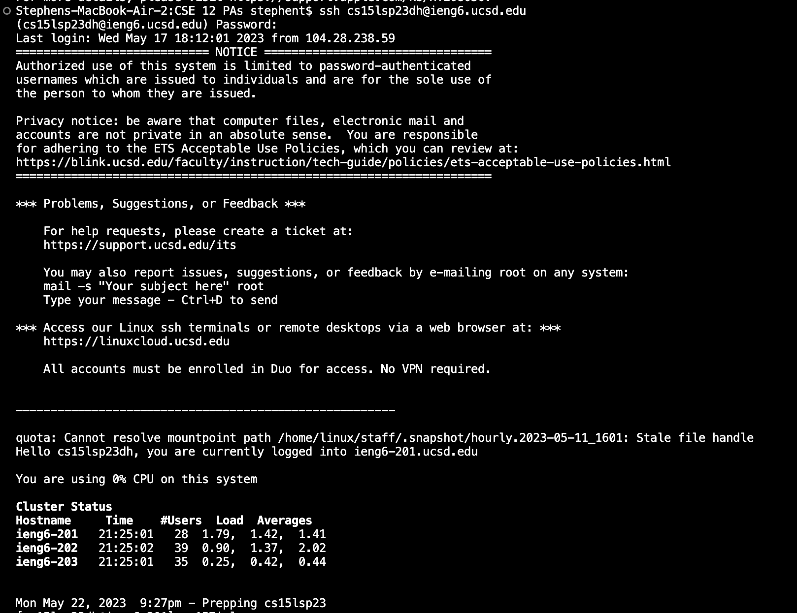
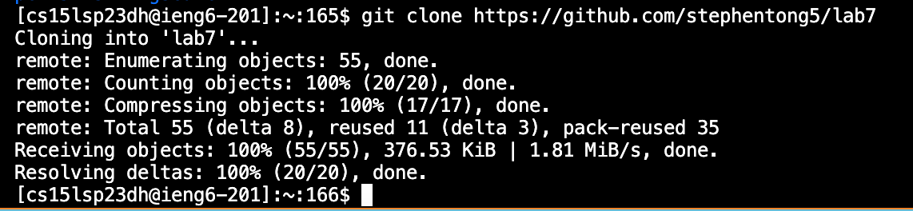
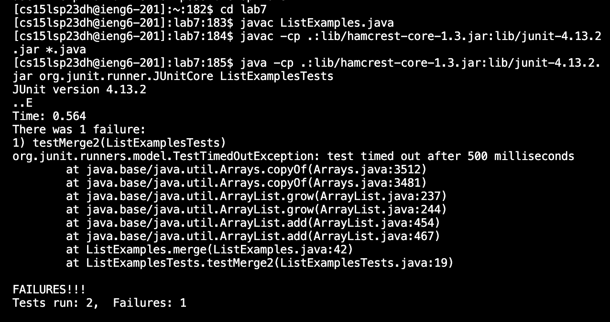
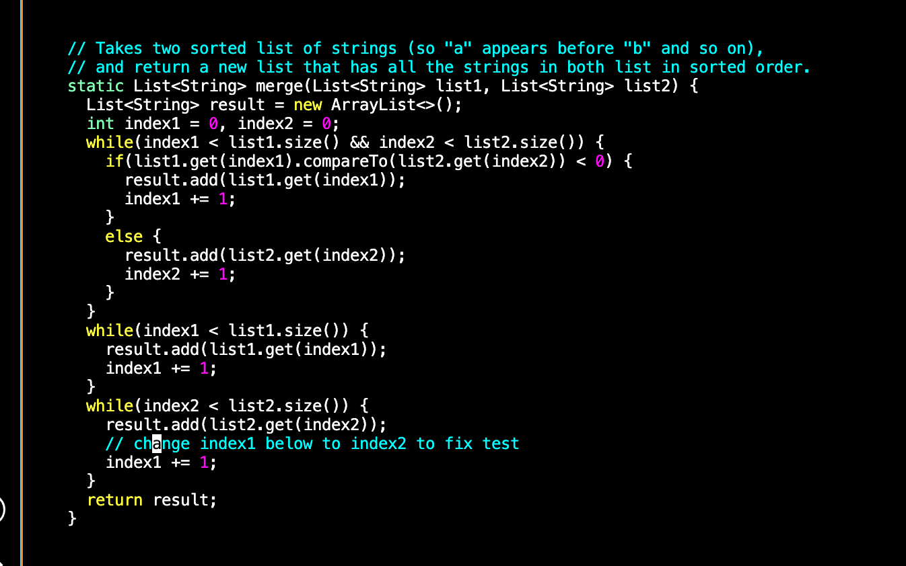
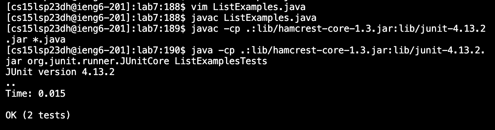
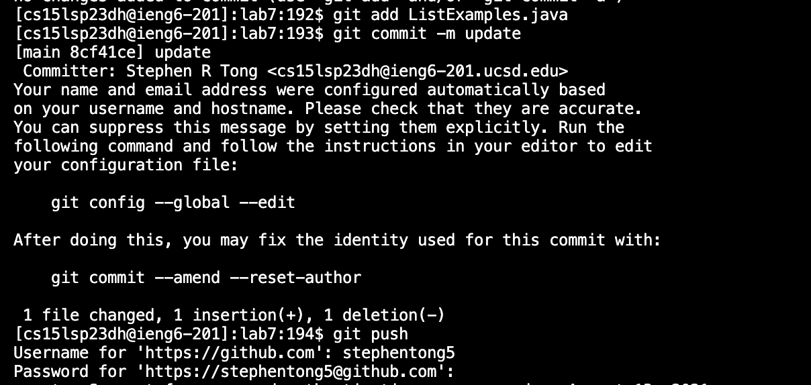

# Task Steps

## Step 1

Delete existing forks of lab7

## Step 2

Fork lab7

## Step 3

Start the timer

## Step 4

Log into ieng6

Keys pressed:

`ssh cs15lsp23dh@ieng6.ucsd.edu <enter>`

`************ <enter>` (* for my password)

I logged into ieng6 using the ssh command with my specific email. I then typed in my password when prompted to confirm it was me.

## Step 5

Clone the fork of lab7

Keys pressed: 

`<command + c>` (copying the url)

`git clone <command + v> <enter>`

I cloned the repository using the git clone command. I copied the url of my forked lab7. I then typed the git clone command and pasted the url to run it.

## Step 6

Run the tests, showing they fail

Keys pressed:

`cd lab7 <enter>`

`javac ListExamples.java <enter>`

`<command + c>` (copying the first JUnit command)

`<command + v> <enter>`
 
`<command + c>` (copying the second JUnit command)

`<command + v> ListExampleTests <enter>`

I first changed directories into lab7 to make it easier on myself. I then compiled the ListExamples java file. I copied the first JUnit command that compiles the JUnit tests. I then pasted it in the terminal and ran it. Then I copied the second JUnit command that runs the tests. I pasted that in the terminal and added ListExamplesTests so JUnit knows what tests to run. I ran that command and tests failed showing bugs in the code.

## Step 7

Edit the code to fix it

Keys pressed:

`vim ListExamples.java`

`j l i <delete> 2 <esc> :wq <enter>`

I opened the file in vim with the first command. I then moved the cursor down one with j and left one with l. I only had to move it a little since it started hovering over the a in change as shown in the picture. I went into insert mode by pressing i. I then deleted the 1 on index1 and typed 2, making it read index2 instead. I escaped out of insert mode back into normal mode. I then saved and quit using :wq.

## Step 8

Run the tests, showing they work now

Keys pressed:

`<up> <up> <up> <up> <enter>` (going back to compile ListExamples.java)

`<up> <up> <up> <up> <enter>` (going back to compile the JUnit tests)

`<up> <up> <up> <up> <enter>` (going back to run the JUnit tests)

I used the terminal command history and went back four commands using the up arrow key. I then compiled ListExamples. I did the same thing with the up arrow keys to compile the JUnit test and then again to run the JUnit tests. I basically repeated step 6, but used shortcuts to do so.

## Step 9

Commit and push this change

Keys pressed:

`git add ListExamples.java <enter>`

`git commit -m update <enter>`

`git push <enter>`

`stephentong5 <enter>`

`********* <enter>` (* for password)

I used git add to add ListExamples.java to the changes, since that was the only file edited. I then used git commit -m to commit these changes with a message. The message is the name of the commit which I called update. I then used git push to push this commit to my GitHub account. It prompted me for my username which I entered and then for my password which I entered. It then successfully pushed the changes.
