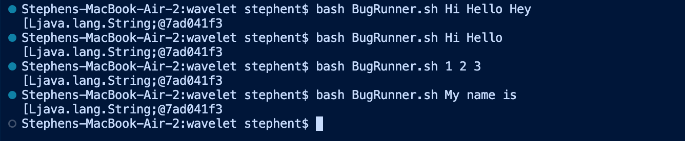
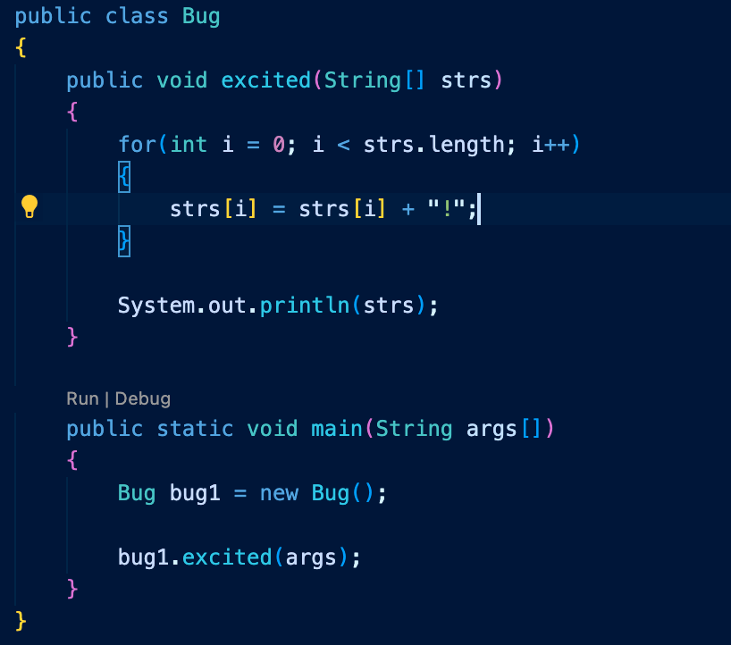
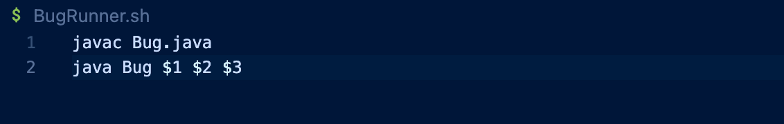
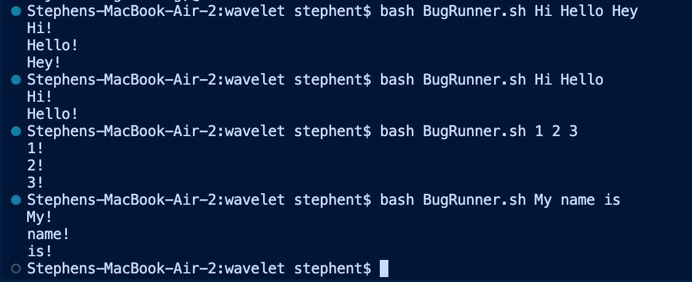
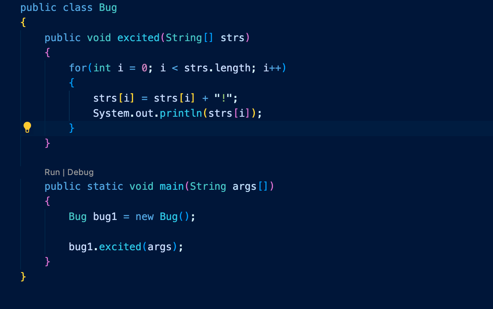

# Debugging Scenario

## Post from Student

**What environment are you using(computer, operating system, web browser, terminal/editor, and so on)?**

I'm using a Macbook Air running MacOS. I'm running the code on VSCode using the built-in terminal on it.

**Detail the symptom you're seeing. Be specific; include both what you're seeing and what you expected to see instead. Screenshots are great, copy-pasted terminal output is also great. Avoid saying "it doesn't work".**

I'm expecting the see the terminal print out each argument with an exclamation point at the end. Instead, I'm seeing a random jumble of letters and numbers that look like the physical address of the array. I'm not really sure how to fix this problem as I don't know why it would be printing out the address of the array.

**Detail the failure-inducing input and context. That might mean any or all of the command you're running, a test case, command-line argumehts, working directory, even the last few commands you ran. Do your best to provide as much context as you can**

This is the java file and bash script I am using to run my code. My java file should take the array given and add an exclamation point to each string and print out the array out. The bash script compiles and runs the code with arguments that represent elements of the array. The code fails for any input I give it and prints out the same memory address each time. This can be seen up above for the output for each command I did in the terminal.

## TA Response

How does Java print arrays? How can you access each element individually?

## Student Response

I figured it out using your hints! I needed to print out each element individually because Java doesn't understand how to print a list so it prints it's memory address. Instead of printing out the array at the end, I printed out each element using a for loop.

## Setup Information

This is all included within each post.

# Reflection

I learned about the different command-line options that each command has. I find it really cool that these commands have so much variation within them. Not only are there hundreds of commands you are able to run, each command has multiple ways to run it. A lot of them are really useful and I will definitely being using them in the future. I even plan on taking some time to learn more of them to get quickly at coding, bug fixing, running comamnds, etc. 
